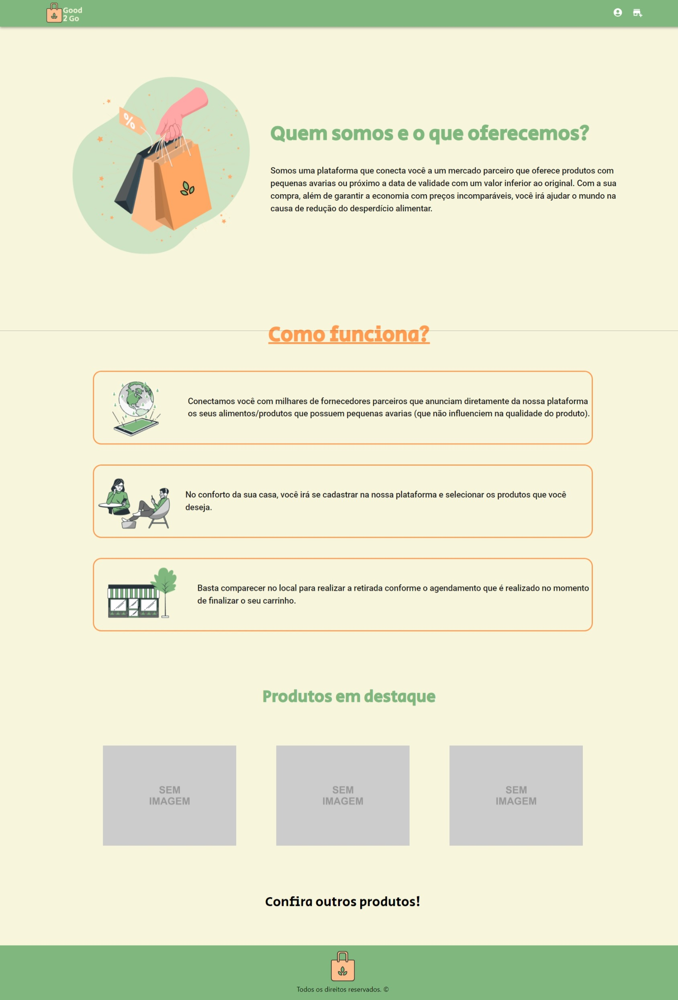

# Good2Go - Mercado Digital para Produtos Imperfeitos

Bem-vindo ao Good2Go, a plataforma que conecta compradores conscientes a produtos alimentares imperfeitos, combatendo o desperdício e promovendo a sustentabilidade.

## Visão Geral

O Good2Go é uma solução inovadora que visa reduzir o desperdício alimentar ao conectar diretamente agricultores, produtores de alimentos, lojistas, varejistas e compradores interessados em produtos de qualidade, mas que podem ter sido descartados devido a critérios estéticos ou excesso de estoque. Também ajudamos os lojistas a adotar práticas mais sustentáveis ao reduzir o desperdício.



### Recursos Principais

- **Listagens de Produtos Imperfeitos**: Explore uma variedade de produtos alimentares imperfeitos, desde frutas e legumes até produtos de panificação e laticínios.

- **Compras Conscientes**: Faça compras de forma sustentável, apoiando agricultores locais e contribuindo para um mundo mais verde.

## Como rodar o projeto

### Clonar o Repositório

1. Crie um diretório com o seguinte comando:
```mkdir good2go``

2. Mude para dentro do diretório com o comando abaixo:
```cd good2go```

3. Faça um clone deste repositório para seu diretório local usando o seguinte comando:
```git clone https://github.com/TaisaBraga/labs-hack-project```


### Configurar o Ambiente backend

1. Certifique-se de ter o Docker instalado em sua máquina. Se você ainda não o tem, você pode baixá-lo em [Docker Website](https://www.docker.com/get-started).

2. Após a configuração e instalação do Docker, no terminal digite:
```docker recompose up --build```

3. Após confirmação do Docker funcionando:
```labs-hack-project2-web-1       | INFO:     Started server process [8]```
abra seu navegador e no espaço de URL, digite para acessar as docs:
```http://localhost:8000/docs#/```

### Configurar o ambiente frontend

1. Certifique- de ter o npm instalado em sua máquina. Se você ainda não o tem, você pode baixá-lo em [npm Docs](https://docs.npmjs.com/downloading-and-installing-node-js-and-npm).
2. NPM INSTALL para baixar as dependências do projeto e 
3. NPM START para executar o aplicativo no modo de desenvolvimento.
4. Abra http://localhost:3000 para visualizá-lo no navegador.

## Contribuindo

Agradecemos seu interesse em contribuir para o Good2Go. Se você deseja participar do desenvolvimento deste projeto, siga estas diretrizes:

1. [Faça um fork](https://docs.github.com/pt/get-started/quickstart/fork-a-repo) deste repositório.

2. Crie um branch com um nome descritivo para suas alterações.

3. Faça suas alterações e [abra um Pull Request](https://docs.github.com/pt/pull-requests/collaborating-with-pull-requests/proposing-changes-to-your-work-with-pull-requests/creating-a-pull-request) descrevendo as mudanças propostas.

4. Colabore com outros desenvolvedores para revisar e melhorar o código.

## Equipe

- [Amanda Tinoco](https://github.com/DeeDee100) - Desenvolvedora Back-End
- [Jonas Macedo](https://github.com/thejonasmacedo) - Desenvolvedor Back-End
- [Rebeca Maria](https://github.com/becamello) - Desenvolvedora Front-End
- [Taisa Braga](https://github.com/TaisaBraga) - Desenvolvedora Front-End
- [Wanessa Cristina](https://github.com/WanessaCristinaa) - Desenvolvedora Front-End

## Licença

Este projeto é licenciado sob a Licença MIT - Veja o arquivo [LICENSE.md](https://github.com/git/git-scm.com/blob/main/MIT-LICENSE.txt) para mais detalhes.

